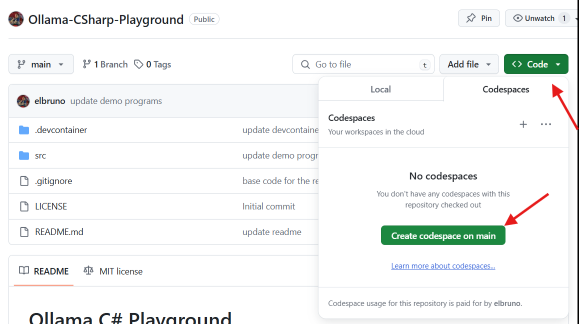
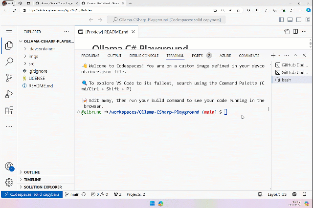
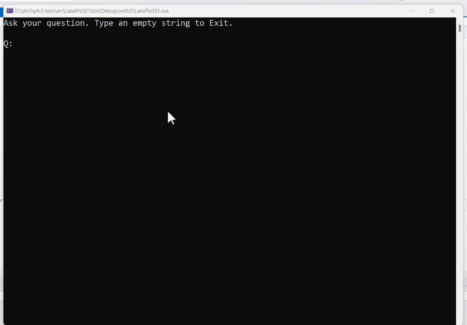

# Ollama C# Playground

[](/LICENSE)
[](https://twitter.com/elbruno)


This project is designed to be opened in GitHub Codespaces as an easy way for anyone to try out SLMs (small language models) entirely in the browser. This project is based on the [Ollama Python Playground](https://github.com/pamelafox/ollama-python-playground/)

1. Create a new  Codespace using the `Code` button at the top of the repository.


1. Once the Codespace is loaded, it should have [ollama](https://ollama.com/) pre-installed as well as [.NET 8](https://dotnet.microsoft.com/en-us/download).
1. Ask Ollama to run the SLM of your choice. For example, to run the [phi3](https://ollama.com/library/phi3) model:

    ```shell
    ollama run phi3:mini
    ```

    That will take a few minutes to download the model into the Codespace.
4. Once you see "success" in the output, you can send a message to that model from the prompt.

    ```shell
    >>> Write a joke about kittens
    ```



5. After several seconds, you should see a response stream in from the model.
6. To learn about different techniques used with language models, check the sample projects in the `.\src` folder:

| Project | Description |
|---------|-------------|
| Sample01  | This is a sample project that uses a the Phi-3 hosted in ollama model to answer a question.  |
| Sample02  | This is a sample project that implement a Console chat using Semantic Kernel.	 |

## How to run a sample

1. Open a terminal and navigate to the desired project. In example, let's run `LabsPhi301`.
    ```bash
    cd .\src\Sample02\
    ```

1. Run the project with the command
    ```bash
    dotnet run
    ```

1.  The sample project ask for a user input and replies using the local mode. 

    The running demo is similar to this one:

    

## References

- [Phi-3 Microsoft Blog](https://aka.ms/phi3blog-april)
- [Phi-3 Technical Report](https://aka.ms/phi3-tech-report)
- [Phi-3 Cookbook](https://aka.ms/Phi-3CookBook)
- [Generative AI for beginners](https://github.com/microsoft/generative-ai-for-beginners)
- [Semantic Kernel main repository](https://github.com/microsoft/semantic-kernel)

## Author

👤 **Bruno Capuano**

* Website: https://elbruno.com
* Twitter: [@elbruno](https://twitter.com/elbruno)
* Github: [@elbruno](https://github.com/elbruno)
* LinkedIn: [@elbruno](https://linkedin.com/in/elbruno)

## 🤝 Contributing

Contributions, issues and feature requests are welcome!

Feel free to check [issues page](https://github.com/elbruno/phi3-labs//issues).

## Show your support

Give a ⭐️ if this project helped you!


## 📝 License

Copyright &copy; 2024 [Bruno Capuano](https://github.com/elbruno).

This project is [MIT](/LICENSE) licensed.

***
